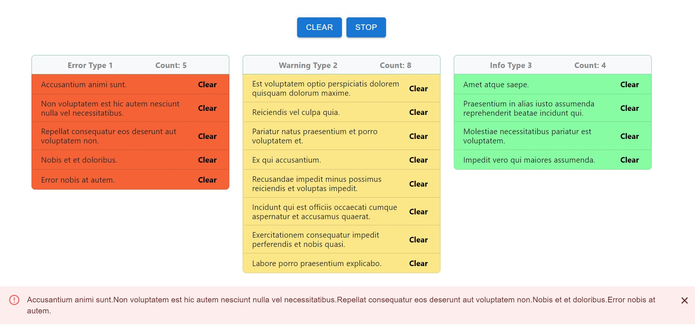

 
<h1 align="center">React TypeScript Challenge</h1>

  <strong>Made by Jenny Cárdenas</strong>
   
  The purpose of the application is to correctly render a stream of messages coming from an api. Different messages will be coded different colors and require slightly different rendering. The rules are described in detail below.This challenge already includes an API response.

  
   ‎ ‎ ‎ ‎
  

## 👩🏼‍💻 About React TypeScript Challenge

## 🔴 Live Demo:

[Check it out](https://messageslist.netlify.app/)

## 🔧 Built With

- React
- TypeScript
- Material UI
- HTML5
- CSS3
- JS (ES6)
- VS Code

## 🤖 How it works

To get a local copy up and running follow these simple steps:

- Go to the main page.
- Press the "Code" button and get the repo link.
- Clone it using git command `you_repository_link`.
- Cd into the folder.
- Go to the default branch with git checkout `branch-name`.
- Run npm install to install dependencies.
- Run npm start and start the server.
- To run tests, run npm test.

## 👥 Author

👤 **Jenny Cárdenas**

- GitHub: [@janis_jenny](https://github.com/janis-jenny)
- Twitter: [@janis_jenny](https://twitter.com/janis_jenny)
- LinkedIn: [Jenny Càrdenas](https://www.linkedin.com/in/paolajenny)

## 🤝 Contributing

Contributions, issues, and feature requests are welcome!

Feel free to check the [issues page](https://github.com/janis-jenny/React-TypeScript-Challenge/issues).

## ⭐ Show your support

Give a ⭐️ if you like this project!

## 📌 Acknowledgments

- [TypeScript Docs](https://www.typescriptlang.org/docs/)
- [React Docs](https://es.reactjs.org/docs/getting-started.html)
- [Material UI](https://mui.com/)
- Stack Overflow
- Youtube

## 📝 License

This project is [MIT](https://opensource.org/licenses/MIT) licensed.